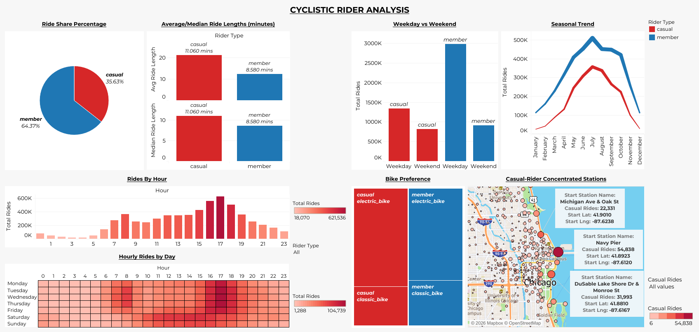

# Cyclistic Bike-Share Analysis

This project is a data analysis case study based on Cyclistic, a fictional bike-share company operating in Chicago.
The objective is to analyze historical trip data and find how annual members and casual riders use Cyclistic bikes differently and identify opportunities to convert casual riders into annual members.

This project was completed as part of the **Google Data Analytics Professional Certificate** capstone project.


## Business Task

Cyclistic's finance team has concluded that annual members are far more profitable than casual riders. The marketing team wants to design a campaign to convert casual riders into annual members, and needs to understand:

1. How do annual members and casual riders use Cyclistic bikes differently?
2. Why would casual riders buy a membership?

This project focuses on question 1: analyzing usage patterns between the two rider types.

## Data

- 12 months of historical trip data **(August 2025 - July 2026)**.
- Provided by Motivate International Inc.
- Given data includes ride_id, rideadble_type, start/end date-time, start/end station id, name and latitude/longitude and rider_type (member/casual).
- Download data [here](https://divvy-tripdata.s3.amazonaws.com/index.html)
- Raw data was not uploaded to GitHub because of large file sizes.

## Tools & Workflow

| Stage | Tool |
|---|---|
| Data cleaning & preparation | Python (Pandas) |
| Data storage | PostgreSQL |
| Data analysis | SQL |
| Visualization & dashboard | Tableau |
| Version control & documentation | Git/GitHub |

**Process:**

1. Combined and cleaned all 12 monthly CSV files using Pandas ([`data-cleaning-script.py`](data-cleaning-script.py) / [`data-cleaning.ipynb`](data-cleaning.ipynb)):
   - Handled missing values, removed duplicates, standardized column formats, corrected data types (timestamps), renamed columns, and calculated derived fields such as ride_length_minutes, hour, day_of_week and month.
2. Loaded the cleaned dataset into PostgreSQL for structured querying.
3. Wrote SQL queries:
   - See [`sql-queries/`](sql-queries/) to explore ride patterns by rider type, time of day, day of week, season, and station popularity.
4. Built an interactive dashboard and visualizations in Tableau:
   - See [`viz/`](viz/) to explore key differences between Cyclistic member and casual rider behavior.


## Key Findings

- Casual riders tend to take longer and more leisure-oriented rides, while members show more routine usage.
- Member usage peaks during weekday commute hours; casual usage peaks on weekends.
- Ride volume is highest in summer months for both groups, but the seasonal swing is sharper for casual riders.

## Dashboard



🔗 **[View the interactive Tableau dashboard here](https://public.tableau.com/views/CyclisticBikeShare_17892334105490/Dashboard1?:language=en-US&:sid=&:redirect=auth&:display_count=n&:origin=viz_share_link)**


## How to Reproduce the Analysis

 Repository Structure

```
cyclistic-bike-share-case-study/
├── data/
│   ├── raw/            # 12 months of historical raw data (CSV files) (Ausgust 2025 - July 2026)
│   ├── cleaned/        # Cleaned/processed data ready for analysis
│   └── analysis/       # Query outputs / aggregated tables used for viz
├── SQL queries/        # SQL scripts used for analysis in PostgreSQL
├── viz/                # Tableau workbook(s) / exported visuals
├── data-cleaning-script.py   # Pandas cleaning & preparation script
├── data-cleaning.ipynb        # Notebook version of the cleaning workflow
├── README.md
├── requirements.txt
├── .gitignore
```

1. **Clone the repo and install dependencies**
```bash
   git clone https://github.com/rachitries/cyclistic-bike-share-data-analysis.git
   cd cyclistic-bike-share-data-analysis
   python -m venv .venv
   source .venv/bin/activate      # on Windows: .venv\Scripts\activate
   pip install -r requirements.txt
```
 
2. **Get the raw data**
   - Download the 12 months of trip data from [here](https://divvy-tripdata.s3.amazonaws.com/index.html) and place the CSV files into `data/raw/`.
     
3. **Run the cleaning script**
```bash
   python data-cleaning-script.py
```
   or open and run [`data-cleaning.ipynb`](data-cleaning.ipynb) step by step. This outputs cleaned files to `data/cleaned/`.
 
4. **Load into PostgreSQL**
   - Create a local database manually (e.g. `CREATE DATABASE cyclistic;`) or run [`create_database.sql`](sql-queries/create_database.sql).
   - To create a table run [`create_table.sql`](sql-queries/create_table.sql).
   - Load the cleaned CSV into your table through GUI manually or use this command
      ```bash
         \copy trips FROM '/path/to/your/file.csv' WITH (FORMAT csv, HEADER true, DELIMITER ',');
      ``` 
      **NOTE: replace '/path/to/your/file.csv' with your actual file path.**
     
5. **Run the analysis queries**
   - Open the scripts in [`sql-queries/`](sql-queries) and run them against your PostgreSQL database. Outputs used for visualization are saved to `data/analysis/`.
     
6. **Explore the dashboard**
   - Explore [Live Tableau interactive dashboard](https://public.tableau.com/views/CyclisticBikeShare_17892334105490/Dashboard1?:language=en-US&:sid=&:redirect=auth&:display_count=n&:origin=viz_share_link)
   - Or open the [Tableau workbook](viz/cyclistic_bike_share_dashboard.twbx)


## Recommendations

1. Launch a weekend-focused membership promotion targeting casual riders.
2. Highlight cost savings of membership for riders who already take frequent long trips.
3. Use targeted digital ads at high-traffic casual-rider stations during peak season.


## Conclusion

The analysis shows a clear behavioral distinction between Cyclistic's two rider groups. Annual members demonstrate more routine usage, while casual riders tend to show stronger weekend, longer-duration, and seasonal riding patterns. These differences suggest that casual riders represent a conversion opportunity, particularly among those who use Cyclistic frequently during peak periods. Cyclistic should therefore use targeted digital marketing based on rider behavior, focusing campaigns around high casual-rider periods and locations and communicating the value and convenience of membership.


## Author
**Rachit Maurya**: [LinkedIn](https://www.linkedin.com/in/rachit-maurya-56194a391/), [X](https://x.com/rachitries)
